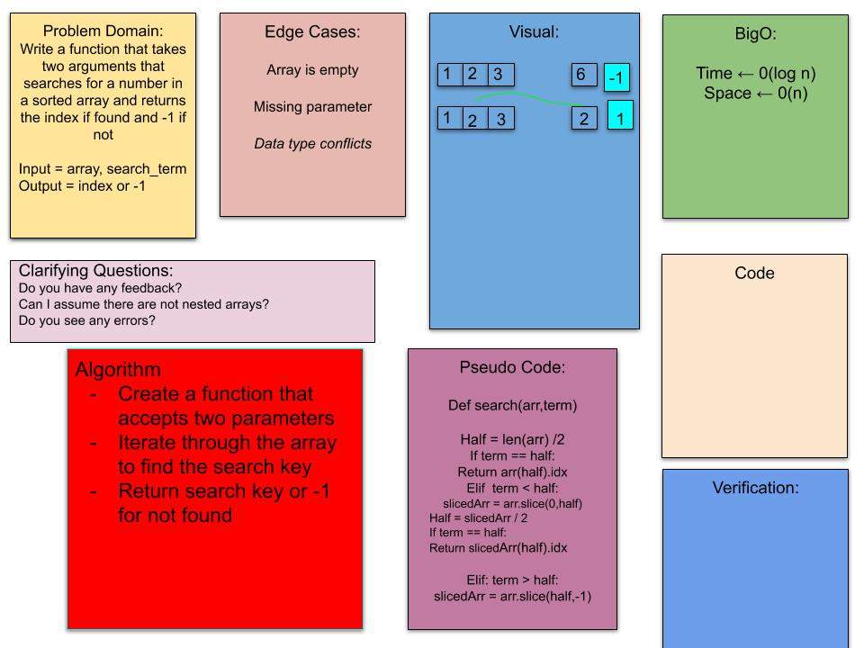

## Authors 
> Brandon Gonzalez

## Description
> given a sorted array of numbers and a number search term function will return teh index of the number or -1 if not in lsit

# Change log
> solved recursively

## Contributors:
Alber falbo partnered for white board

## whiteboard

