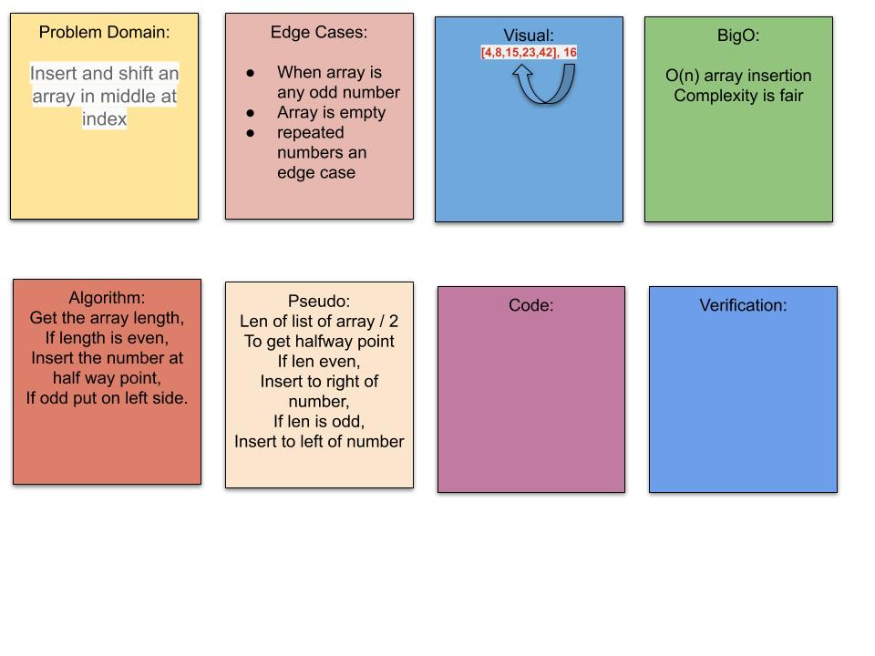

# Challenge Summary
<!--  This challenge is to be able to insert a random number into the middle of an ordered arrat -->

## Challenge Description
<!--  determine middle index od array and insert value -->

### approach
<!-- approach isto get the mid point of the array my modding the length by two and picking left or right depending on mod value of the larrays length / 2 -->

