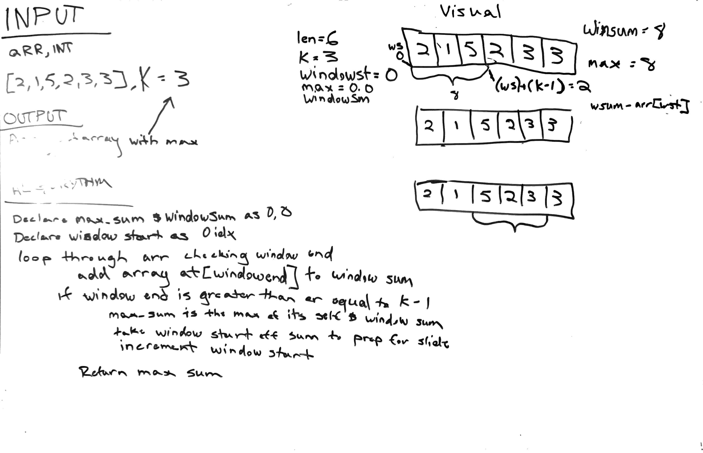

# Max SubArray
> Given an array [] and an int k determine the subarray of k size with the maximum sum off all subarray members

## Chalenge
> Return subarray with maximum sum

## approach and efficiency
> The approach to this problenm is to use a sliding window so as to not have to loop through each subarray seperately.

## whiteboard 

