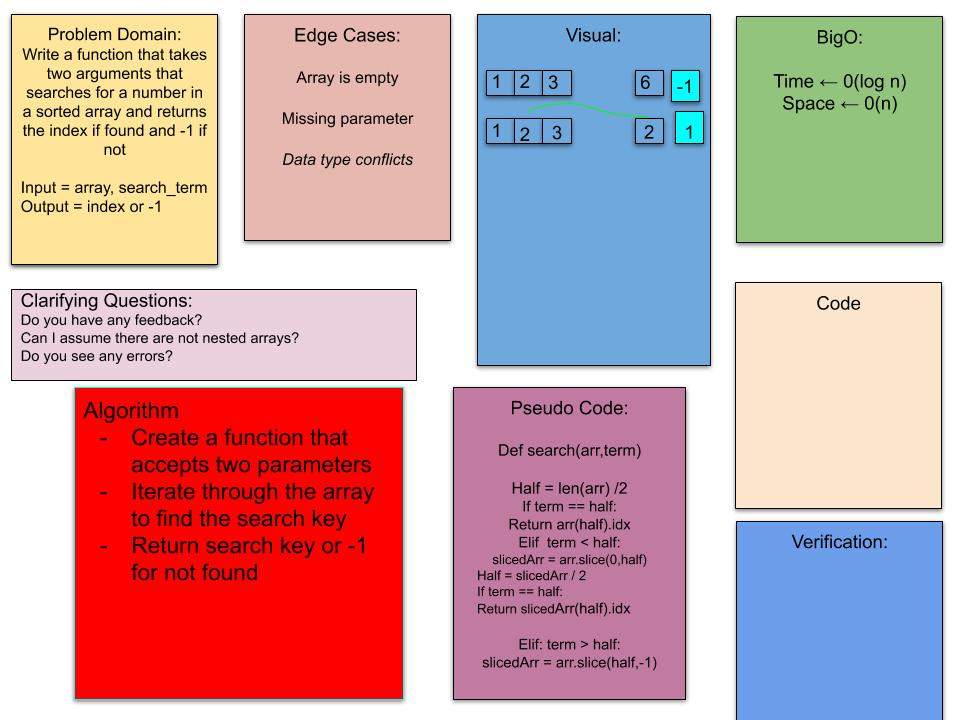

## Authors 
> Brandon Gonzalez

## Description
> given a sorted array of numbers and a number search term function will return teh index of the number or -1 if not in lsit

# Change log
>  1.0 solved recursively

> 1.1 fixed recursive functionality to solver certain specail cases and to return correct indexes
for item is latter half of array
    

## Contributors:
Alber falbo partnered for white board

## whiteboard

