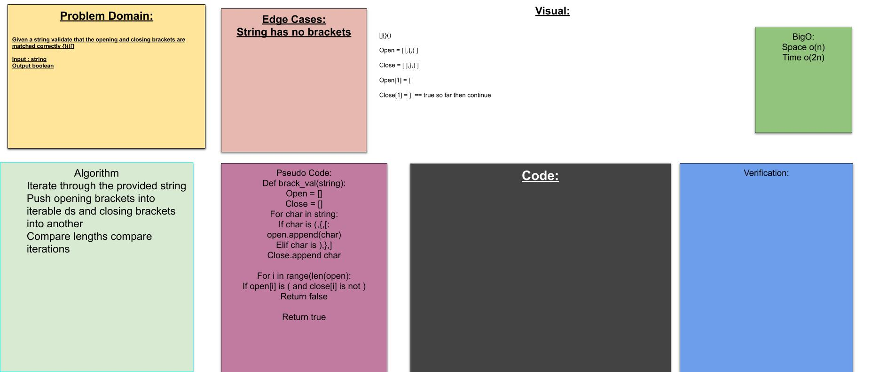

## Challenge Description
create a function that check if a string has balanced brackets

### approach
creat a dictonary of key value pairs of opening and clsoed brackets iterate through the string and append the  value to a helper structure if the closing letter is found and either the structure is empty return false else return the opposite of the truthy value of the helper structure

## Changle log

## Pull Request

[Pull Request](https://github.com/bjgman12/data-structures-and-algorithms/pull/35)

## contributors 
> stack overflow stack exchange and geek for geeks all played a role in me figuring this out