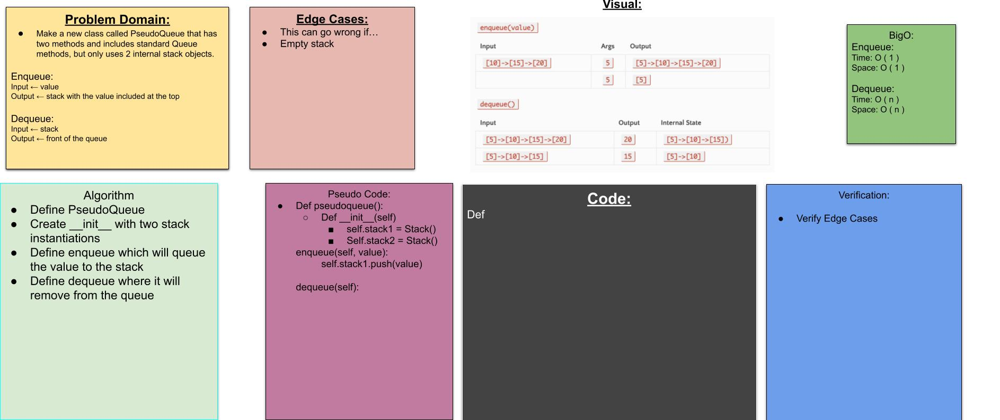

# Challenge Summary
 > Create a PseudoQueue class that have 2 stacks in init and can operate on the stack with Q methods while reetaining stack integrity

## Challenge Description

### approach
 since the push and enqueue methods are essentailly the same i just used pop for that

for dequeue i used a list helper structure

## Changle log

## Pull Request

[Pull Request](https://github.com/bjgman12/data-structures-and-algorithms/pull/32)