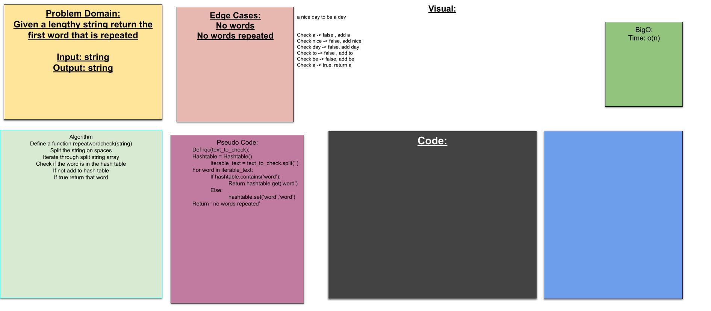

# REPEATED WORDS
> this uses my implementation of a hashtable to determine the first repeated word in lengthy strings

## Chalenge
> taking in a string of long text determine the first word repeated

## approach and efficiency
> this uses my hashtable set and contains methods to check if the word is there returning it if it is alreay a member

## API
repeated_word_check will retrun the first repeated word or No Words Repeated if it finds no repeats

