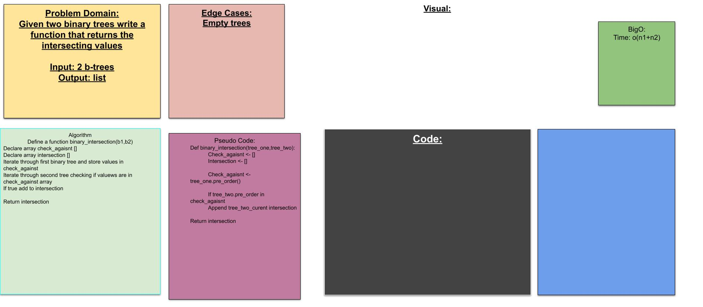

## Tree intersection

## Challenge
> write a function given two binary trees that will return the intersection of the tree

## Approach and efficiency
> check the values of a breadth first traveral on tree one agaisnt the value of tree two and return values that occur in both

> o(n+m): Time
> o(n or m):Space (being which ever has the lower amount of nodes)

