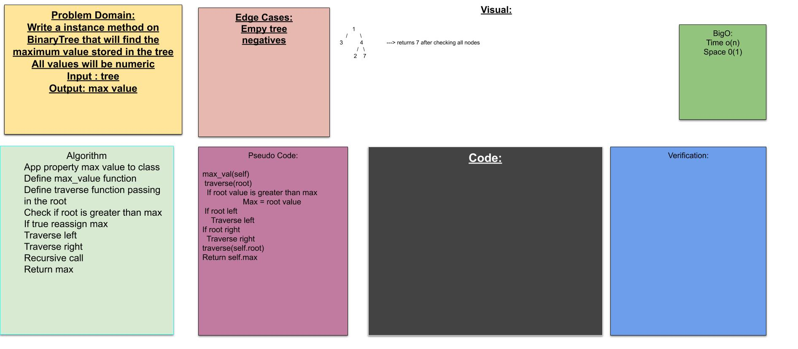
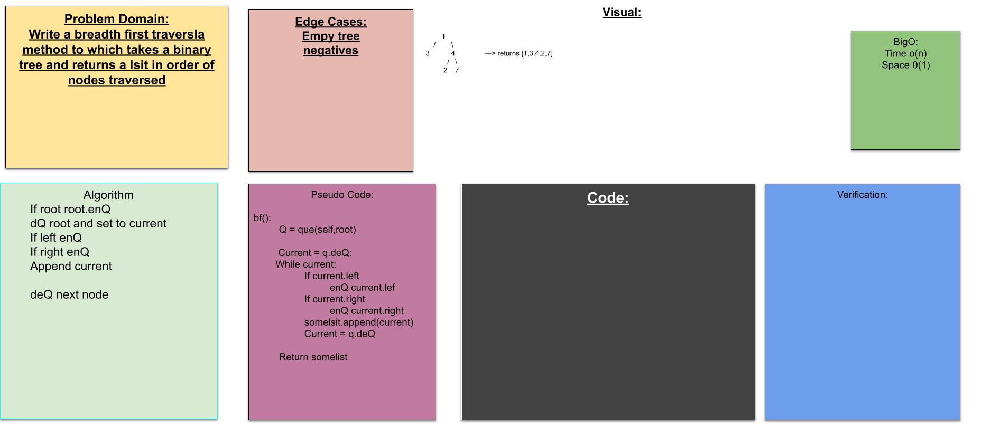

# Trees
 > implementation of binary tree data structure

 ## challenge
 > write a BT with pree post and inorder traversal methods then write BST with an add and contains method
 ## Efficiency
 efficiency for searcing binary tree should be o(log(n))

 ## Find MAx Value

 ## challenge
  write a function that will find the maximun value in a binary tree

  ## approach 
  > i used pre order traversal to find the maximum value

 
  [PR](https://github.com/bjgman12/data-structures-and-algorithms/pull/36)

## Breadth first 

## challenge
    write a function that takes in a binary tree and returns a list in breadth first order

    
    [PR](https://github.com/bjgman12/data-structures-and-algorithms/pull/37)